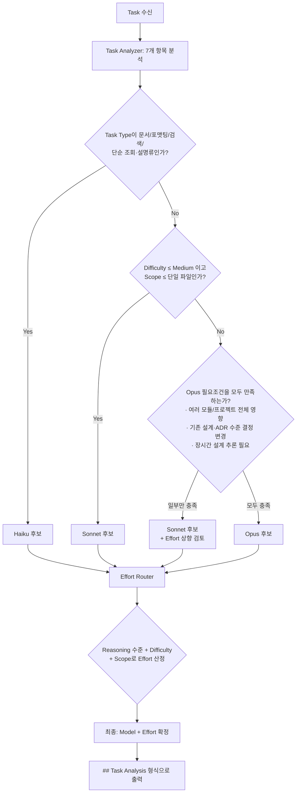

# Smart Model Router

Claude Code에서 작업을 실행하기 **전에** 가장 비용 효율적이면서 품질을
해치지 않는 Claude 모델과 Effort(추론 노력치)를 결정하는 Skill이다.

```
Task → Task Analyzer → Model Router → Effort Router → Claude 실행
```

이 문서(SKILL.md)는 두 부분으로 명확히 나뉜다.

- **§A 범용 판단 프레임워크** — Provider(Claude/OpenAI/Gemini 등)에 무관한
  일반 로직. "작업을 어떻게 분석하고 어떤 순서로 등급을 매길지"를 다룬다.
- **§B Claude 전용 규칙** — Haiku/Sonnet/Opus라는 **Claude 모델 이름**과
  Effort 값을 실제로 매핑하는 표. Provider별로 교체되는 부분이다.

이렇게 나누는 이유는, 이 Skill이 향후 AI Workspace의 Provider Router 안에서
`ClaudeProvider`의 내부 로직으로 그대로 이식될 예정이기 때문이다. §A는 그대로
재사용하고, §B만 Provider별 설정으로 교체하면 다른 Provider에도 같은 구조를
쓸 수 있다. 자세한 이식 방법은 맨 아래 "확장 포인트" 절을 참고한다.

---

## §A. 범용 판단 프레임워크 (Provider-agnostic)

### A-1. Task Analyzer — 7개 판단 항목

작업을 실행하기 전 아래 7가지를 **모두** 분석한다. 하나라도 건너뛰면 등급
판단이 왜곡되므로, 확신이 없는 항목은 근거를 추정치로 표시하고 넘어간다.

| # | 항목 | 값 |
|---|---|---|
| 1 | Task Type | Documentation / Planning / Architecture / Review / Implementation / Refactoring / Debugging / Testing / Research / Formatting |
| 2 | Difficulty | Very Low / Low / Medium / High / Very High |
| 3 | Effort(요구치) | Minimal / Low / Medium / High / Maximum |
| 4 | Scope(변경 범위) | 함수 / 클래스 / 파일 / 여러 파일 / 모듈 / 프로젝트 전체 |
| 5 | 예상 토큰 사용량 | Low / Medium / High (예상 입력·출력·컨텍스트 크기 종합) |
| 6 | Reasoning 수준 | 거의 필요 없음 / 일반 추론 / 깊은 분석 / 장시간 설계 추론 |
| 7 | Project Stage | 설계 / 구현 / 테스트 / 문서화 / 유지보수 |

**Effort와 Model은 서로 다른 축이다.** Model은 "이 작업을 처리할 능력이
있는가"를, Effort는 "이 작업에 얼마나 오래·깊게 생각을 투입해야 하는가"를
판단한다. 같은 Sonnet이라도 Effort를 Low로 쓸 수도, High로 쓸 수도 있다.

**프로젝트가 이미 안정적인 상태라는 점을 반영한다.** 설계 일관성이 높고
품질 게이트(lint/type-check/test)가 이미 통과하는 저장소에서는, 파일명이나
표현에 "architecture", "설계" 같은 단어가 들어 있다는 이유만으로 등급을
과도하게 올리지 않는다. 실제로 여러 모듈에 영향을 주거나 기존 설계 결정을
뒤집는 작업인지를 근거로 판단한다(§B의 Opus 조건 참고).

### A-2. 의사결정 원칙 (우선순위 순서)

1. **가장 작은 모델로 가능한지 먼저 판단한다.** Haiku가 처리할 수 있는
   작업이면 그것으로 확정하고 더 검토하지 않는다.
2. **부족하면 한 단계만 올린다.** Haiku로 부족하면 Sonnet, Sonnet으로도
   부족할 때만 Opus를 검토한다. 단계를 건너뛰지 않는다.
3. **Sonnet으로 해결되는 작업에는 Opus를 쓰지 않는다.** "혹시 몰라서
   Opus"는 금지한다. Opus는 §B의 조건을 모두 만족할 때만 후보가 된다.
4. **모델을 올리기 전에 Effort를 올리는 것으로 충분한지 먼저 검토한다.**
   예: 파일 여러 개를 고치는 버그 수정은 대개 Sonnet + High Effort로
   충분하며, 모듈 구조 자체를 바꾸는 것이 아니라면 Opus로 올릴 필요가 없다.
5. **토큰 비용 대비 품질을 항상 함께 고려한다.** 같은 결과를 더 적은 토큰과
   더 저렴한 모델로 얻을 수 있다면 그쪽을 택한다.

### A-3. 의사결정 트리



**텍스트 알고리즘 (mermaid를 못 읽는 상황 대비):**

1. Task Type이 문서/포맷팅/검색/단순 설명이면 → **Haiku 후보**로 시작.
2. 아니라면, Difficulty가 Medium 이하이고 Scope가 파일 단위 이하이면 →
   **Sonnet 후보**로 시작(기본값).
3. 그 이상이라면, §B의 Opus 필요조건 4가지를 확인한다.
   - **모두** 충족 → **Opus 후보**.
   - 일부만 충족 → **Sonnet 후보를 유지하되 Effort를 High로 올리는 것을
     우선 검토**(A-2 원칙 4).
4. 후보 Model이 정해지면 Effort Router로 넘어가 §B의 Effort 표로 Effort를
   확정한다.
5. 최종 Model + Effort를 "## Task Analysis" 형식으로 출력한다.

---

## §B. Claude 전용 규칙 (Provider-specific config)

> 이 절만 Claude 모델 이름과 Effort 값을 다룬다. 다른 Provider로 이식할 때는
> 이 절 전체를 교체하면 된다(맨 아래 확장 포인트 참고).

### B-1. Model 선택 규칙

**Haiku** — 가능하면 가장 먼저 선택한다.
README/문서 수정, ADR 수정(내용 변경 없는 정리 수준), 주석 작성, Formatting,
Lint 수정, 파일/코드 검색, 기존 코드 설명, 테스트 실행, 간단한 테스트 작성,
단순 리서치, TODO 정리.

**Sonnet** — 기본 모델. 아래 작업은 Opus로 올리지 않는다.
일반 개발, 버그 수정, 신규 기능, 함수/클래스 구현, Workspace Core 구현,
Skeleton 작성, 코드 리뷰, 일반 리팩터링, Interface 구현, 계약 테스트 작성,
여러 파일에 걸친 통상적인 수정.

**Opus** — 마지막 수단. 아래 조건을 **모두** 만족할 때만 선택한다.
- 시스템/아키텍처 설계, 프로젝트 구조 변경, 인터페이스 재설계
- 여러 모듈 구조 변경 (단순히 여러 파일을 고치는 것과는 다르다 — 모듈 간
  **경계나 책임**이 바뀌는지가 기준)
- 복잡한 알고리즘 설계, ADR 수준의 설계 방향 결정
- 장시간·다단계 추론이 필요함

하나라도 빠지면 Opus 후보에서 제외하고 Sonnet + High Effort를 우선 검토한다.

### B-2. Effort 선택 규칙

| Effort | 해당 작업 |
|---|---|
| **Minimal** | Formatting, README/문서 수정, 검색, 간단한 설명 |
| **Low** | 작은 함수 수정, 주석 작성, TODO 수정, 테스트 실행 |
| **Medium**(기본값) | 일반 구현, 버그 수정, 테스트 작성, 코드 리뷰, 일반 리팩터링 |
| **High** | 복잡한 버그, 여러 파일 수정, 구조 개선, 설계 검토, 성능 개선 |
| **Maximum** | 시스템 설계, 아키텍처 재설계, 장시간 추론, 프로젝트 방향 결정 |

전형적인 조합은 `Haiku+Minimal`, `Sonnet+Medium`, `Opus+Maximum`이지만
고정된 것은 아니다. 예를 들어 "여러 파일에 걸친 까다로운 버그"는 모듈 구조를
바꾸지 않으므로 **Sonnet + High**가 맞고, Opus로 올릴 이유가 없다.

---

## 출력 형식

항상 아래 형식 그대로 출력한다(필드명·순서 고정, 값이 없으면 빈 칸으로 두지
말고 최선의 추정치를 적는다).

```
## Task Analysis

Task Type:
Difficulty:
Effort:
Scope:
Estimated Token Cost:
Reasoning:
Project Stage:
Recommended Model:
Recommended Effort:
Reason:
```

- `Effort:`는 A-1의 분석 결과(요구되는 노력치 추정), `Recommended Effort:`는
  §B-2를 적용한 최종 결정이다. 대부분 같은 값이지만, A-2 원칙 4에 따라
  Model을 올리지 않기 위해 Effort만 조정한 경우 서로 달라질 수 있다.
- `Reason:`에는 왜 그 Model/Effort를 선택했는지 **그리고 왜 한 단계 위
  Model을 선택하지 않았는지**를 한두 문장으로 함께 적는다("Sonnet으로 충분한
  이유"를 명시하는 것이 "Opus를 쓴 이유"를 적는 것만큼 중요하다).

---

## 출력 최적화 규칙

이 Skill 자신의 응답과, 이 Skill이 추천한 이후 실제 작업 응답 모두에 적용한다.

1. 변경된 부분만 출력한다 — 파일 전체를 재생성하지 않는다.
2. 설명은 최소화한다 — 불필요한 배경 설명, 반복 예시를 넣지 않는다.
3. 토큰을 최소화한다 — 같은 정보면 더 짧은 표현을 택한다.
4. 큰 변경(Scope가 여러 파일 이상)은 먼저 계획을 제안한 뒤, 승인/확인 후
   구현한다 — 계획 없이 바로 대규모 변경을 쏟아내지 않는다.

---

## 사용 예시 (요약)

아래는 대표적인 3개 예시다. 20개 이상의 더 다양한 사례는
`references/examples.md`를 참고한다.

**예시 1 — 단순 문서 수정**
> 입력: "README에 설치 방법 섹션 하나만 추가해줘"
```
## Task Analysis

Task Type: Documentation
Difficulty: Very Low
Effort: Minimal
Scope: 파일(단일, README.md)
Estimated Token Cost: Low
Reasoning: 거의 필요 없음
Project Stage: 문서화
Recommended Model: Haiku
Recommended Effort: Minimal
Reason: 기존 문서에 섹션을 추가하는 정형적인 문서 작업으로 추론이 거의
필요 없다. Sonnet 이상을 쓸 이유가 없다.
```

**예시 2 — 일반적인 Interface 구현**
> 입력: "Workspace Core 골격에 ProjectRepository를 주입해서 프로젝트 로드
> 로직을 구현해줘"
```
## Task Analysis

Task Type: Implementation
Difficulty: Medium
Effort: Medium
Scope: 파일(1~2개)
Estimated Token Cost: Medium
Reasoning: 일반 추론
Project Stage: 구현
Recommended Model: Sonnet
Recommended Effort: Medium
Reason: 기존 Interface 계약을 그대로 소비하는 통상적인 구현이며 새로운
설계 판단이 필요 없다. Sonnet 기본값으로 충분하다.
```

**예시 3 — 실제 아키텍처 변경**
> 입력: "Agent Runtime과 Engine Runtime 사이의 의존 방향을 재설계하고
> 관련 ADR을 새로 작성해줘"
```
## Task Analysis

Task Type: Architecture
Difficulty: Very High
Effort: Maximum
Scope: 모듈(여러 컴포넌트 경계 변경)
Estimated Token Cost: High
Reasoning: 장시간 설계 추론
Project Stage: 설계
Recommended Model: Opus
Recommended Effort: Maximum
Reason: 컴포넌트 간 책임 경계 자체를 바꾸고 ADR 수준의 설계 결정이 필요해
Opus의 §B-1 필요조건을 모두 만족한다. Sonnet으로는 설계 근거의 깊이가
부족하다.
```

---

## 향후 AI Workspace Provider Router 이식을 위한 확장 포인트

이 Skill은 지금은 Claude Code 전용이지만, AI Workspace가 M4에서 계획 중인
Policy Engine/Provider Router(`.ai/RULES.md` §7 "Temporary LLM Policy",
`src/ai_workspace/domain/llm_policy.py`)에 그대로 이식하도록 설계했다.

- **§A(범용 판단 프레임워크)는 그대로 재사용한다.** Task Analyzer의 7개
  판단 항목, A-2 의사결정 원칙, A-3 의사결정 트리는 어떤 LLM Provider를
  쓰든 동일하게 적용되는 로직이다. AI Workspace 쪽에서는 이 부분이
  `Router`(가칭, Provider에 무관한 공통 판단 엔진)의 책임이 된다.
- **§B(Claude 전용 규칙)만 Provider별 설정으로 교체한다.** 이 Skill의
  §B는 `ClaudeProvider`가 소비할 설정 데이터로 그대로 옮길 수 있다. 예를
  들어 `LLMProvider.OPENAI`용 Provider를 만든다면, §B-1/§B-2와 동일한 표를
  `gpt-mini`/`gpt`/`gpt-pro` 같은 실제 모델 이름으로 다시 채우기만 하면
  된다 — §A는 손댈 필요가 없다.
- **Effort 단계 수 불일치에 유의한다.** 이 Skill은 Effort를 5단계
  (Minimal/Low/Medium/High/Maximum)로 판단하지만, 현재
  `domain/llm_policy.py`의 `LLMEffort`는 3단계(LOW/MEDIUM/HIGH)만
  정의되어 있다. 이식 시 다음 중 하나를 선택해야 한다.
  1. `LLMEffort`를 5단계로 확장한다(Domain 변경, ADR 필요).
  2. 이 Skill의 5단계를 3단계로 축소 매핑한다
     (`Minimal/Low → LOW`, `Medium → MEDIUM`, `High/Maximum → HIGH`).
  현재는 Domain을 건드리지 않고 이 Skill 자체는 5단계를 유지하는 편이,
  YAGNI 원칙과 "Temporary LLM Policy"가 아직 M2(Rule 기반 선택)도 시작하지
  않은 현재 단계에 맞다.
- **Task Analyzer는 향후 별도 컴포넌트로 승격될 수 있다.** 지금은 이 Skill
  안에 §A로 내장되어 있지만, AI Workspace에서는 Agent가 Task를 Engine
  Runtime에 넘기기 **전** 단계에서 실행되는 독립된 판단 로직(Task Analyzer)
  으로 분리하는 것이 §8 의존성 규칙(Agent → Engine Runtime → Engine
  Adapter)과 자연스럽게 맞물린다. 다만 이는 실제 코드 변경이 필요한 설계
  결정이므로, 사용자 승인 없이 지금 진행하지 않는다(YAGNI, Architecture
  First 원칙).
- **참고 문서**: `docs/llm_policy.example.yaml`(현재는 문서 기반 정책),
  `.ai/RULES.md` §7(M2~M5 진행 경로), `src/ai_workspace/domain/llm_policy.py`
  (`LLMProvider`/`LLMModel`/`LLMEffort`/`INITIAL_MODELS`).
